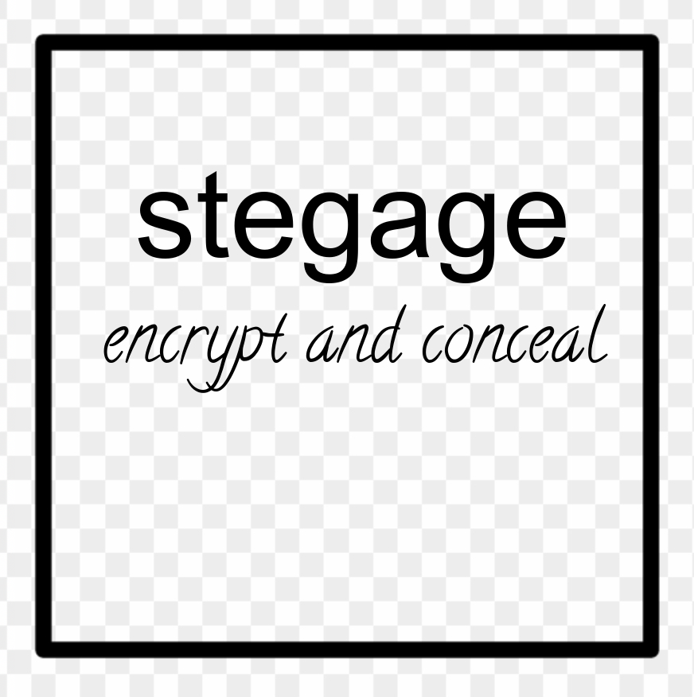

**stegage** is a simple command line tool and Go library to both encrypt
(with [age](https://github.com/FiloSottile/age)) and conceal
(with [steganography](https://github.com/auyer/steganography)) a file.

| Original image             |Encoded image with the encrypted file inside |
| -------------------- | ------------------|
|   | 

## How it works

### encode

**stegage** encrypts a file (f.ex. `doc.txt`) with a passphrase and embeds the
encrypted file inside an image (f.ex. `stegage.jpeg`. The resulting image `stegage_encoded.png` is
visually identical to the original image `stegage.jpeg`.

    ┌────────────┐              ┌────────────┐
    │    doc.txt │    encrypt   │ doc.txt.enc│
    │            ├─────────────►│            ├────┐
    │            │              │            │    │          ┌─────────────────────────────────┐
    │            │              │            │    │          │              stegage_encoded.png│
    └────────────┘              └────────────┘    │  stegano │                                 │
                                                  │  graphy  │                                 │
              ┌─────────────────────────────────┐ ├─────────►│   ┌────────────┐                │
              │                    stegage.jpeg │ │          │   │ doc.txt.enc│                │
              │                                 │ │          │   │            │                │
              │                                 │ │          │   │            │                │
              │                                 │ │          │   │            │                │
              │                                 │ │          │   └────────────┘                │
              │                                 ├─┘          │                                 │
              │                                 │            └─────────────────────────────────┘
              │                                 │
              │                                 │
              │                                 │
              └─────────────────────────────────┘

The supported image formats for embedding are `jpeg` and `png`. The resulting image format is always `png`.

### decode

**stegage** extracts the encrypted file from the embedding image and decrypts it. 

    ┌─────────────────────────────────┐
    │              stegage_encoded.png│
    │                                 │                 ┌────────────┐            ┌────────────┐
    │                                 │                 │ doc.txt.enc│            │    doc.txt │
    │   ┌────────────┐                │  steganography  │            │  decrypt   │            │
    │   │ doc.txt.enc│                ├────────────────►│            ├───────────►│            │
    │   │            │                │                 │            │            │            │
    │   │            │                │                 └────────────┘            └────────────┘
    │   │            │                │
    │   └────────────┘                │
    │                                 │
    └─────────────────────────────────┘

## Usage

### encode 

Encrypt the file `doc.txt` and embed the encrypted payload in a copy of
`stegage.png`.  Save the copy to the file `stegage_encoded.png`. 

    ⤷ stegage encode --inside stegage.png doc.txt > stegage_encoded.png 
    Enter passphrase:
    Confirm passphrase:

### decode

Extract the encrypted payload from the file `stegage_encoded.png` and decrypt
it. Save the decrypted payload to the file `doc.txt` 

    ⤷ stegage decode stegage_encoded.png >  doc.txt
    Enter passphrase:

## Installation

If your system has Go 1.17+:

    go install github.com/revelaction/stegage/cmd...@v0.5.0-beta

 
## Library Usage

### encode

    // error handling omitted for brevity. See ./cmd/stegage/main.go for a real example
	image, _ := os.Open(image.png) 

	passphrase:= strings.NewReader("aj4@7%8821vja")
	data, _ := os.Open("doc.txt")

    out, _ := os.Create("encoded.png") 

	err := stegage.Encode(passphrase, data, image, out); err != nil {
        fmt.Printf("stegage: error encoding: %v", err)
	}

### decode

	imageEncoded, _ := os.Open(image_encoded.png)
	passphrase := strings.NewReader("aj4@7%8821vja")
    out, _ := os.Create("doc.txt") 

	err := stegage.Decode(passphrase, imageEncoded, out); err != nil {
        fmt.Printf("stegage: error decoding: %v", err)
	}

## Bash Completion

`stegage` has builtin bash autocompletion. You can enable it by putting the following bash
snippet in your `.bashrc` file:

    if hash stegage; then
        PROG=stegage source <(stegage bash)
    fi

